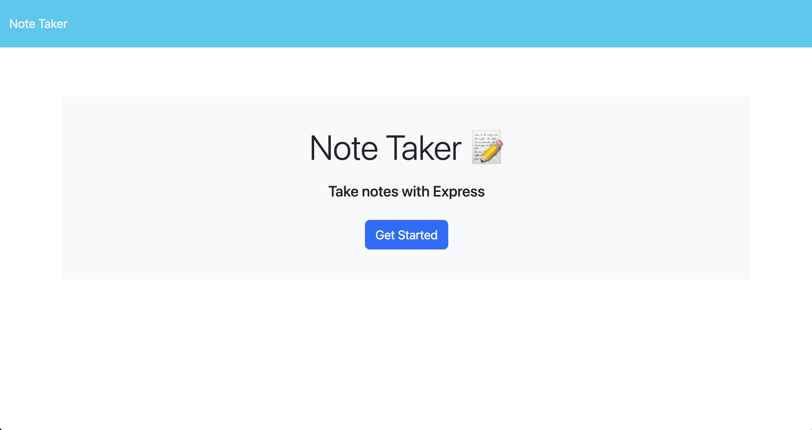
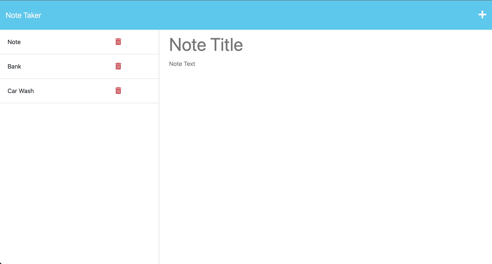

# Note_Taker_App

## Description

This code creates a Note Taker App. The user is able to create a title and text then save the note to the dashboard. To view the note again, click on it, if you want to take another note click the '+', and if you want to delete an existing note click on the trash can by the note you wish to delete.

## Installation

N/A

## Usage

[Link to Landing Page](https://note-taker-app-amy-kleynhans-bced0d2e3492.herokuapp.com/)

 
Homepage for Note Taker App

 
Note Taker App with saved Notes

## Credits

[link to middleware examples](https://expressjs.com/en/guide/writing-middleware.html) 
